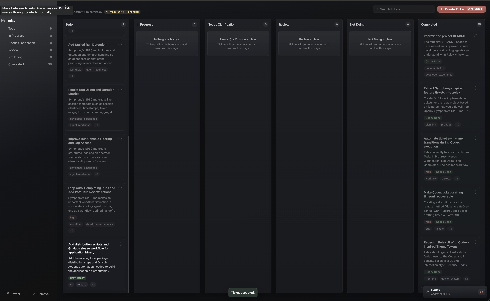
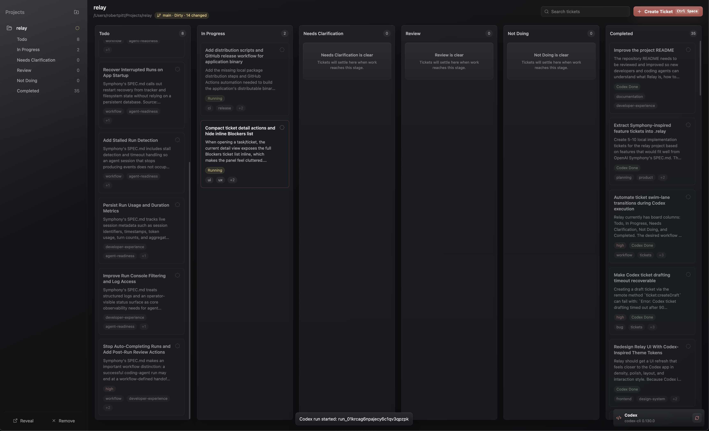
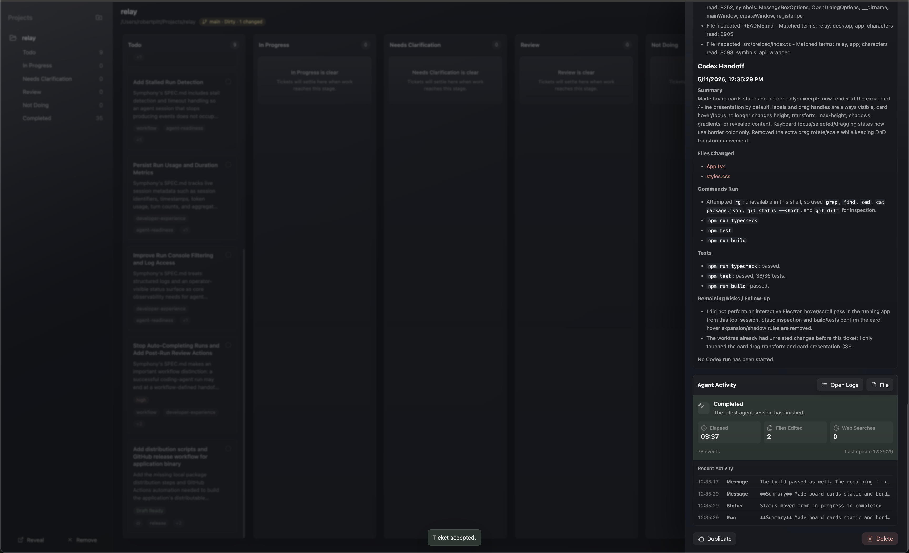

# Relay

Relay is a working prototype for local software work management. It depends on Codex for agent-backed drafting and execution, so install and authenticate Codex before using those flows.

Relay is a local-first Electron desktop app for managing software work as kanban cards and running Codex from those cards. It is built with React, TypeScript, and `@openai/codex-sdk`.

## Quick Start

### Clone

```sh
git clone <repo-url>
cd relay
```

### Install

```sh
npm install
```

### Dev

```sh
npm run dev
```

Optional Codex check for agent-backed drafting or execution:

```sh
codex --version
codex login
```

## Showcase







## What Relay Does

Relay is designed for one developer working across local project folders. Each project stores its board state in a project-local `.relay/` directory, keeping tickets and run history portable with the codebase.

Relay has three runtime pieces:

- `src/main/`: Electron main process for IPC handlers, filesystem access, project initialization, app registry storage, logging, run events, and Codex SDK lifecycle.
- `src/preload/`: typed `window.relay` bridge exposed to the renderer through Electron IPC.
- `src/renderer/`: React UI for the project sidebar, board, ticket editor, draft flow, run console, and user-facing errors.

Local development does not require a database server, container stack, hosted issue tracker, or `.env` file.

## Prerequisites

- Node.js 18 or newer.
- npm. The current lockfile is `package-lock.json`.
- Git, strongly recommended. Relay can manage boards for non-Git folders, but Codex execution is disabled by default for non-Git projects.
- Codex CLI and Codex authentication for agent-backed ticket drafting or execution.

Manual board and ticket management does not require Codex. Codex-backed drafting and execution require `codex` on `PATH` plus an authenticated Codex session or API key.

## First Project

To initialize a project in the app:

1. Click `Add Project`.
2. Choose a local project folder.
3. Confirm initialization when Relay asks to create `.relay/`.
4. Create a manual ticket or use Codex to draft one.
5. Open a ticket and start or resume a Codex run when needed.

## Keyboard Shortcuts

Relay keeps `Tab` for normal accessibility focus traversal. Ticket browsing uses Arrow keys or `J`/`K` when focus is on the board, a ticket card, or the page body.

| Shortcut | Action |
| --- | --- |
| `Esc` | Close the topmost dialog, modal, or ticket drawer when there is no unsaved input. |
| `Cmd`+`Space` on macOS, `Ctrl`+`Space` elsewhere | Open Create Ticket from the main board context. |
| `Arrow Down` / `Arrow Right` / `J` | Focus the next ticket on the board. |
| `Arrow Up` / `Arrow Left` / `K` | Focus the previous ticket on the board. |

## Local Data

Relay uses filesystem storage instead of a database.

Project state lives under each project's `.relay/` directory:

```text
<project>/
  .relay/
    project.json
    tickets/
      <ticket-id>.md
    clarifications/
      <ticket-id>.json
    runs/
      <ticket-id>/
        <run-id>.jsonl
    audit.jsonl
    attachments/
    backups/
    trash/
```

Key files:

- `.relay/project.json` stores project metadata, columns, and settings.
- `.relay/tickets/<ticket-id>.md` stores tickets as Markdown with YAML front matter.
- `.relay/clarifications/<ticket-id>.json` stores formal clarification questions and answers.
- `.relay/runs/<ticket-id>/<run-id>.jsonl` stores streamed Codex run events.
- `.relay/audit.jsonl` records status changes and clarification events.

Relay also stores an app-level registry and log under Electron `userData`. On macOS, with the current package name, the log script tails:

```text
~/Library/Application Support/relay/relay.log
```

The registry only caches known project folders. Removing a project from the sidebar should not delete that project folder or its `.relay/` data.

## Codex and Secrets

Codex authentication is discovered from one of these sources:

- `~/.codex/auth.json`, usually created by `codex login`.
- `OPENAI_API_KEY`
- `CODEX_API_KEY`

Relay inherits environment variables from the shell that launched it. If you use an API key, export it before running `npm run dev`.

Do not commit or store API keys, Codex auth tokens, bearer tokens, or other secrets in `.relay/`, ticket Markdown, run logs, or committed files.

`ELECTRON_RENDERER_URL` is used internally by `electron-vite` during development. You should not need to set it manually for normal local work.

## Commands

| Command | Purpose |
| --- | --- |
| `npm install` | Install dependencies from `package-lock.json`. |
| `npm run dev` | Start the Electron app in development mode with `electron-vite`. |
| `npm run dev:logs` | Start development mode and tee process output to `/tmp/relay-dev.log`. |
| `npm run logs:dev` | Tail `/tmp/relay-dev.log` from a separate terminal. |
| `npm run logs` | Tail the Relay app log at `~/Library/Application Support/relay/relay.log` on macOS. |
| `npm test` | Run the Node test suite in `tests/`. |
| `npm run typecheck` | Run TypeScript with `tsc --noEmit`. |
| `npm run build` | Run TypeScript checks and build Electron main, preload, and renderer output. |
| `npm run clean:dist` | Remove generated distributable binary output from `dist/`. |
| `npm run package:binary` | Package the already-built Electron output into a distributable binary archive for the current OS and CPU architecture. |
| `npm run dist` | Clean `dist/`, run the production build, package the current-platform binary, and write a checksum. |
| `npm run preview` | Preview the built Electron app with `electron-vite preview`. |

`package.json` does not currently define `lint` or `format` scripts. Use `npm test`, `npm run typecheck`, and `npm run build` as the available verification commands until those workflows are added.

## Repository Map

```text
.
  SPEC.md                    Product and architecture specification.
  electron.vite.config.ts    Electron Vite build configuration.
  package.json               npm scripts and dependencies.
  tests/                     Node test suite for backend, IPC, renderer helpers, and UI flows.
  src/
    main/                    Electron main process, IPC, window lifecycle, and services.
      ipc/                   Typed IPC definitions, schemas, registration, and method handlers.
      services/
        storage/             .relay project config, ticket Markdown, clarification, audit, and trash helpers.
        registry/            App-level project registry persisted under Electron userData.
        codex/               Codex drafting, ticket update, execution, status, and bounded research flows.
        run-events/          JSONL run log writing and renderer event fan-out.
        git/                 Cached project Git metadata.
        io/                  File, path, process, HTTP, and socket boundaries for backend code.
        logger/              App log helpers.
        runtime/             Effect runtime and app layer composition.
      window/                Main window orchestration and run event delivery.
    preload/                 Typed window.relay bridge exposed to the renderer.
    renderer/                React app, styles, components, and renderer helper libraries.
    shared/                  Shared runtime types and IPC contract.
```

Treat generated or local-only directories such as `node_modules/`, `out/`, and project `.relay/runs/` logs as output, not source.

## Development Workflow

Before changing behavior, read `SPEC.md` and the relevant service or renderer code. The spec is the source for product intent, while the TypeScript implementation is the source for current commands and runtime behavior.

Keep process boundaries intact:

- Filesystem access, dialogs, logging, `.relay` initialization, and Codex work belong in the Electron main process.
- Renderer code should call the typed API exposed by `src/preload/index.ts`.
- Shared request and response shapes should live in `src/shared/types.ts`; shared IPC channel signatures should live in `src/shared/ipc.ts`.

For changes that touch ticket files or run state, verify storage in `src/main/services/storage/` and validation schemas in `src/main/services/schemas.ts`. For IPC changes, update both `src/shared/ipc.ts` and the matching method module under `src/main/ipc/methods/`, then keep `src/preload/index.ts` aligned.

For Codex flows, start in `src/main/services/codex/index.ts`. Ticket drafting uses `CreateDraftInput`, `TicketDraft`, `TicketCreateInput`, and `draftToCreateInput`; ticket update uses `AgentTicketUpdateInput` and `AgentTicketUpdate`; execution uses `StartRunInput`, ticket run state, clarification records, and run events.

For coding agents working from Relay tickets:

- Follow the ticket text exactly and ask for clarification when a required product or implementation decision is missing.
- Use subagents conservatively when available and useful: delegate only independent sidecar work, keep urgent blocking work local, assign bounded and disjoint ownership for code-editing workers, and avoid subagents for small or tightly coupled tickets.
- Do not mark tickets completed yourself unless explicitly asked.
- End with a handoff that includes changes made, files changed, commands run, tests run, subagent usage or `none used`, and remaining risks.

For code changes, run at least:

```sh
npm run typecheck
```

Run `npm run build` when changes affect Electron, Vite, packaging, or cross-process behavior.

## Distribution

Build a local release archive for the current operating system and CPU architecture:

```sh
npm run dist
```

The distribution command writes a portable Electron app archive and matching SHA-256 checksum under `dist/`. Artifact names use this pattern:

```text
relay-<version-or-tag>-<platform>-<arch>.tar.gz
relay-<version-or-tag>-<platform>-<arch>.tar.gz.sha256
```

Windows builds use `.zip` instead of `.tar.gz`. By default, the version label is `v<package.json version>`. Set `RELAY_RELEASE_VERSION` when building a tagged release locally:

```sh
RELAY_RELEASE_VERSION=v0.1.0 npm run dist
```

GitHub Actions builds the binary on Linux, macOS, and Windows in `.github/workflows/build-binary.yml`. Pushing a `v*` tag runs `.github/workflows/release-binary.yml`, builds platform artifacts, and publishes them to the matching GitHub Release with `contents: write` scoped only to the publish job.

## Troubleshooting

### `Codex CLI was not found on PATH`

Install or expose the Codex CLI in the shell that starts Relay. Verify with:

```sh
codex --version
```

Manual ticket creation still works without Codex.

### `Codex is not authenticated`

Run:

```sh
codex login
```

Alternatively, export `OPENAI_API_KEY` or `CODEX_API_KEY` before launching Relay.

### Codex execution is blocked for a project

Relay disables Codex execution by default when the selected project is not a Git repository. Use a Git-backed project folder for Codex runs, or intentionally enable non-Git runs in that project's `.relay/project.json` by setting `settings.allowNonGitCodexRuns` to `true`.

### The board shows invalid ticket files

Check `.relay/tickets/*.md`. Ticket front matter must include the fields defined in `src/shared/types.ts`, and each ticket `status` must match a column ID in `.relay/project.json`.

### Runtime errors or blank app window

Start the app with log capture in one terminal:

```sh
npm run dev:logs
```

Inspect the development log from another terminal:

```sh
npm run logs:dev
```

For app-level logs on macOS, use:

```sh
npm run logs
```

### TypeScript or build failures after dependency changes

Reinstall dependencies from the lockfile, then rerun verification:

```sh
npm install
npm run typecheck
npm run build
```
