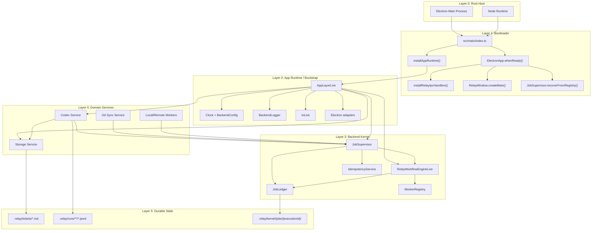
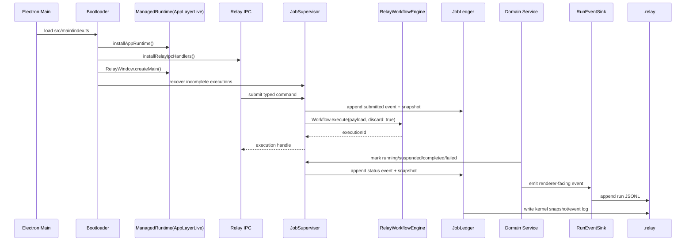

# Effect-Layered Architecture

Relay's Electron main process now boots a single Effect runtime from `AppLayerLive`.

## Runtime Config

Backend process config is owned by `src/main/services/runtime/index.ts` and installed into the desktop app through `src/main/services/runtime/appLayer.ts`. The runtime reads these Effect `Config` keys from the default environment provider; missing values keep the listed defaults.

| Env key | BackendConfig field | Default |
| --- | --- | --- |
| `RELAY_GIT_METADATA_CACHE_TTL_MS` | `gitMetadataCacheTtlMs` | `3000` |
| `RELAY_GIT_COMMAND_TIMEOUT_MS` | `gitCommandTimeoutMs` | `5000` |
| `RELAY_CODEX_STATUS_TIMEOUT_MS` | `codexStatusTimeoutMs` | `5000` |
| `RELAY_STORAGE_ADAPTER` | `storageAdapter` | `filesystem` |

Tests can parse the same config spec with `ConfigProvider.fromUnknown` through `loadBackendConfig`.

## Boundaries

- `src/main/index.ts` is the bootstrap: install runtime, register IPC, create the window, wire lifecycle shutdown.
- `src/main/services/runtime/` owns the shared `ManagedRuntime`, `BackendConfig`, clock, logger service tag, and `AppLayerLive`.
- `src/main/services/io/` is the only backend location for direct Node filesystem, path, child process, fetch, and future socket adapters. Domain services consume Effect services or IO facades from here.
- `src/main/electron/` is the only backend location that imports Electron runtime APIs directly. It is split into primitive services for app lifecycle, windows, dialogs, shell, and raw IPC.
- `src/main/window/RelayWindow.ts` owns Relay-specific window orchestration: main-window creation, reveal/focus behavior, renderer load failure logging, and run-event dispatch.
- `src/main/ipc/` owns the internal IPC boundary. `RelayIpc` registers handlers through the Electron IPC adapter, schema-decodes renderer args, runs Effect handlers, schema-encodes results, and can remove handlers on scope close.
- `src/main/ipc/methods/` owns schema-backed method definitions by public API area: projects, board, tickets, and Codex.
- `src/shared/ipc.ts` owns channel names, argument tuples, and result types used by preload and main.
- `src/main/services/run-events/` owns run JSONL persistence plus renderer event emission.
- `src/main/services/git/` and `src/main/services/registry/` expose Effect services with Promise facades for compatibility.
- `src/main/services/storage/` owns `.relay` persistence helpers, paths, file operations, IDs, ticket errors, and ticket/project behavior.
- `src/main/services/kernel/` owns durable backend execution: `JobLedger`, `JobSupervisor`, `RelayWorkflowEngineLive`, idempotency, worker registry, and the only approved production import of `effect/unstable/workflow`.
- `src/main/services/codex/` owns Codex status, draft research, draft generation, ticket update, run execution, cancellation, and error payload mapping.
- `src/renderer/src/lib/relayApi.ts` is the renderer access point for the preload API.

## Backend Kernel Layers

## Runtime Flow

## Compatibility Rules

- `window.relay` method names stay stable.
- No Effect types are exported through shared renderer contracts.
- `.relay` ticket, clarification, audit, and run log formats stay stable.
- `.relay/kernel/jobs/{executionId}/snapshot.json` and `events.jsonl` are the durable backend execution store.
- Codex still uses `@openai/codex-sdk`; the run sink replaces direct `BrowserWindow` coupling without changing event payloads.
- Raw Node IO imports, raw fetch calls, raw socket usage, direct Electron imports, and unstable Workflow imports are guarded by `tests/import-boundaries.test.ts`. Electron imports are allowed only in `src/main/electron/` and preload. Unstable Workflow imports are allowed only in `src/main/services/kernel/`.

## Transitional Facades

Some modules still expose Promise-returning functions because Electron IPC and existing tests use Promise boundaries. New backend internals should prefer `Context.Service` plus `Layer`, consume IO through `src/main/services/io/`, and keep Promise conversion at IPC or test adapter edges.

For backend execution control, see `docs/effect-workflow-lifecycle-evaluation.md`; Relay keeps board columns plus ticket `runStatus` user-visible while the kernel ledger becomes authoritative for backend job execution state.
