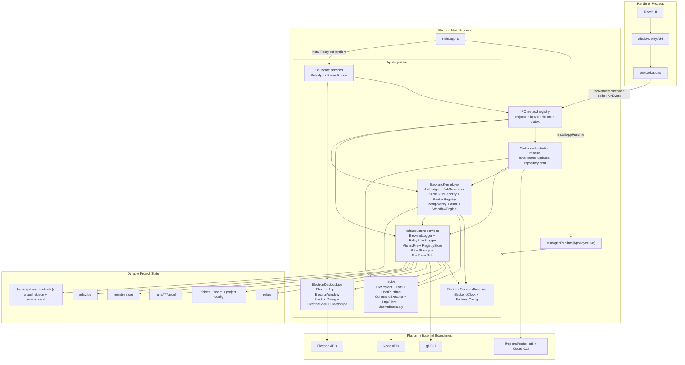
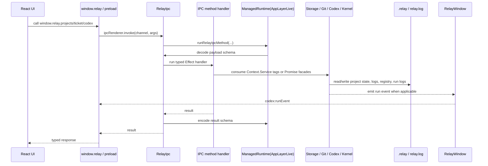

# Effect-Layered Architecture

Relay's Electron main process boots one long-lived Effect `ManagedRuntime` from `AppLayerLive` in `src/runtime/appLayer.ts`.
The renderer, preload bridge, IPC transport, backend services, durable kernel, and filesystem stores are kept behind explicit runtime layers and service tags.

## Runtime Config

Backend process config is owned by `src/runtime/index.ts` and installed into the desktop app through `src/runtime/appLayer.ts`.
The runtime reads these Effect `Config` keys from the default environment provider; missing values keep the listed defaults.

| Env key | BackendConfig field | Default |
| --- | --- | --- |
| `RELAY_GIT_METADATA_CACHE_TTL_MS` | `gitMetadataCacheTtlMs` | `3000` |
| `RELAY_GIT_COMMAND_TIMEOUT_MS` | `gitCommandTimeoutMs` | `5000` |
| `RELAY_CODEX_STATUS_TIMEOUT_MS` | `codexStatusTimeoutMs` | `5000` |
| `RELAY_STORAGE_ADAPTER` | `storageAdapter` | `filesystem` |

Tests can parse the same config spec with `ConfigProvider.fromUnknown` through `loadBackendConfig`.

## Layer Diagram

## Service Inventory

| Layer | Services / modules | Role |
| --- | --- | --- |
| Bootstrap | `src/main.app.ts`, `installAppRuntime`, `runBackendEffect` | Installs the runtime, waits for Electron readiness, registers IPC handlers, creates the window, recovers kernel jobs, and wires shutdown. |
| Base | `BackendClock`, `BackendConfig` | Shared time source and environment-backed config for backend services. |
| IO adapters | `FileSystem`, `Path`, `HostRuntime`, `CommandExecutor`, `HttpClient`, `SocketBoundary` via `IoLive` | Single backend location for filesystem, paths, environment, child processes, fetch, and socket boundaries. |
| Electron adapters | `ElectronApp`, `ElectronWindow`, `ElectronDialog`, `ElectronShell`, `ElectronIpc` | Single backend location for direct Electron API usage. |
| Boundaries | `RelayIpc`, `RelayWindow` | Schema-decodes/encodes IPC calls, registers handlers, owns Relay window behavior, and sends run events to the renderer. |
| Infrastructure | `BackendLogger`, `RelayEffectLoggerLive`, `AtomicFile`, `RegistryStore`, `Git`, `GitCli`, `GitMetadataCache`, `Storage`, `RunEventSink` | Logging, atomic writes, project registry, git metadata, project/ticket persistence, and renderer-facing run event persistence/emission. |
| Storage stores | `ProjectStore`, `TicketStore`, `ClarificationStore`, `ArtifactStore`, `AuditLog`, `RunLog` | Filesystem-backed stores merged into `FileSystemStoresLive`, then exposed as the higher-level `Storage` service. |
| Kernel | `JobLedger`, `JobSupervisor`, `KernelRunRegistry`, `WorkerRegistry`, `IdempotencyService`, `AuditService`, `RelayWorkflowEngineLive` | Durable job submission, status transitions, cancellation/resume, in-memory active run registry, and Effect Workflow integration. |
| Codex orchestration | `src/services/codex/index.ts` | Promise-facing orchestration for implementation runs, ticket drafts, ticket updates, and repository chat. It is not currently exposed as a production `Context.Service`; it submits kernel jobs and uses storage/run-event services through the backend runtime. |
| Optional HTTP transport | `src/http/RelayHttpServer.ts` | Local HTTP adapter over the same `relayIpcMethods` and `runRelayIpcMethod` pipeline, mainly covered by transport tests. |

## Request Flow

## Kernel Job Flow

## Boundary Rules

- `src/main.app.ts` is the bootstrap: install runtime, register IPC, create the window, recover jobs, and wire lifecycle shutdown.
- `src/runtime/` owns the shared `ManagedRuntime`, base services, runtime runner, config, and `AppLayerLive`.
- `src/io/` and `src/platform/` are the approved backend boundaries for Node and Electron runtime APIs.
- `src/ipc/` owns schema-backed internal IPC. Shared renderer contracts live in `src/shared/ipc.ts`; no Effect types cross that boundary.
- `src/storage/` owns `.relay` project persistence and storage service composition.
- `src/services/kernel/` owns durable backend execution and is the only approved production import site for `effect/unstable/workflow`.
- `src/services/codex/` owns Codex run orchestration and maps agent events into storage, kernel status, and renderer-facing run events.
- `tests/import-boundaries.test.ts` enforces the raw IO, Electron, Workflow, and Codex lifecycle-map boundaries.

## Compatibility Rules

- `window.relay` method names stay stable.
- No Effect types are exported through shared renderer contracts.
- `.relay` ticket, clarification, audit, and run log formats stay stable.
- `.relay/kernel/jobs/{executionId}/snapshot.json` and `events.jsonl` are the durable backend execution store.
- Codex still uses `@openai/codex-sdk`; the run sink replaces direct `BrowserWindow` coupling without changing event payloads.

## Transitional Facades

Some modules still expose Promise-returning functions because Electron IPC and existing tests use Promise boundaries.
New backend internals should prefer `Context.Service` plus `Layer`, consume IO through `src/io/`, and keep Promise conversion at IPC or test adapter edges.

For backend execution control, see `docs/effect-workflow-lifecycle-evaluation.md`; Relay keeps board columns plus ticket `runStatus` user-visible while the kernel ledger becomes authoritative for backend job execution state.
