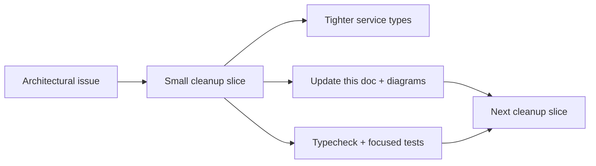
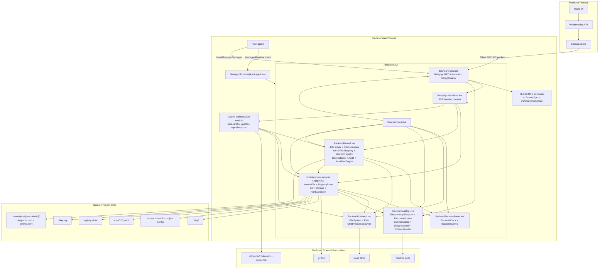
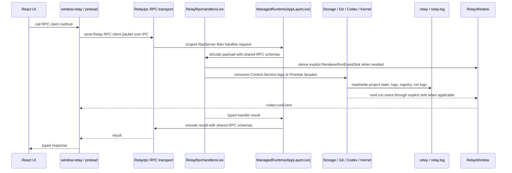
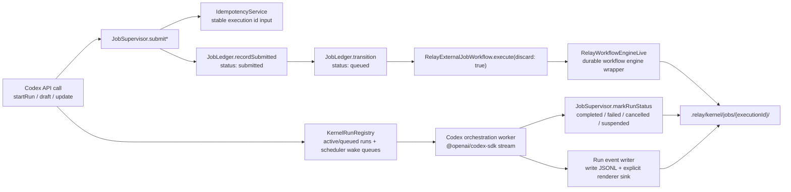

# Effect-Layered Architecture

Relay's Electron main process assembles the Electron live layer and app service graph directly in `src/main.app.ts`, then boots one long-lived Effect `ManagedRuntime`.
The renderer, preload bridge, IPC transport, backend services, durable kernel, and filesystem stores are kept behind explicit runtime layers and service tags.

## Architecture Cleanup Goal

Relay should use Effect because its services and layers make the application easier to reason about, not because every module has been wrapped in Effect-shaped syntax.
The target is a small, provable backend graph:

- one composed main-process runtime;
- explicit service requirements with no `any` service holes and no broad runtime casts;
- Promise conversion only at renderer, IPC, HTTP, CLI/test, or SDK boundaries;
- durable worker execution owned by the kernel, not by detached module-level async loops;
- shared contracts that are intentionally shared, while backend runtime services stay backend-only.

The cleanup work should proceed in thin vertical slices. After each slice, this document and its diagrams should be updated in the same change so the architecture description remains a constraint on the code, not a retrospective.

## Cleanup Sequence

1. Restore the type system baseline.
   Reintroduce or replace the missing runtime config exports used by tests, then keep `npm run typecheck` and `npm test` green before architectural work continues.

2. Make the layer graph prove itself.
   Remove main app requirement casts by composing the exact live layer requirements. A missing service should be a compile-time failure, not a runtime surprise. The remaining Promise runners should accept only the service sets they actually provide.

3. Clarify shared Effect usage.
   `src/shared/` may use Effect Schema/RPC only as transport contract definitions. Backend services, runtime layers, fibers, and application effects must not leak into renderer contracts. Renderer code may host the RPC client adapter, but it should not import backend platform modules beyond a small preload-safe protocol adapter.

4. Make storage genuinely Effect-native.
   Convert storage stores so they consume `FileSystem`, `Path`, `AtomicFile`, `BackendClock`, and config through their declared requirements instead of calling Promise functions that call `runBackendEffect` internally.

5. Make the kernel own execution.
   Move queued worker intent, scheduling, fibers, cancellation, and recovery behind kernel services. Codex should provide command-specific workers and event mapping; the kernel should own durable execution state and lifecycle.

6. Shrink transitional facades.
   Keep Promise-returning public APIs only where they are real boundaries. Internal services should compose with `Context.Service`, `Layer`, scoped resources, and typed errors.

## Current Cleanup Status

| Date | Slice | Status |
| --- | --- | --- |
| 2026-05-14 | Runtime config contract | `BackendConfigDefaults`, `BackendConfigSpec`, and `loadBackendConfig` are exported from `src/runtime/index.ts` again so contract tests use the same Effect config spec as the app. |
| 2026-05-14 | Main layer graph | `src/main.app.ts` now builds `BackendBaseLive`, `CoreServicesLive`, and `AppLayerLive = RelayRpcHandlersLive.pipe(Layer.provideMerge(CoreServicesLive))`. The startup effect is typed against `Layer.Success<typeof AppLayerLive>` instead of casting layer requirements away. |
| 2026-05-14 | RPC/schema service requirements | Shared RPC schemas now use a service-free `RelaySchema<T>` codec alias, and the IPC RPC server is forked as a scoped fiber. This prevents `unknown` schema services from widening the app layer requirements. |
| 2026-05-15 | Runtime runner integrity | The mutable `configureBackendRuntime` service-locator bridge is removed. `runBackendEffect` now runs only `BackendServices` effects, while app-runtime work uses explicit boundary dependencies and runner options. |
| 2026-05-15 | Renderer run-event boundary | The mutable `configureRendererRunEventSink` global is removed. RPC handlers derive a `RendererRunEventSink` from the typed `RelayWindow` service and pass it into Codex Promise facades explicitly; fallback run-event writes remain durable-only. |
| 2026-05-15 | Electron app lifecycle supervision | Process and Electron lifecycle event routing moved out of `src/main.app.ts` and into the `ElectronApp` service. The entrypoint starts `electronApp.startLifecycleSupervision(...)` and awaits `electronApp.awaitShutdown()` instead of owning event loops inline. |
| 2026-05-15 | Contract surface pruning | Removed dead lifecycle listener methods from `ElectronAppService`, deprecated ticket-draft timeout dependency knobs, the unused `fromSync` runtime helper, and placeholder platform services that had no production behavior. |
| 2026-05-15 | Backend platform boundary | Removed the separate IO service folder. `BackendPlatformLive` now provides only filesystem, path, and child-process adapters. Electron host facts such as app paths, environment, runtime platform, and package resolution live on `ElectronApp`; URL fetches use a small platform helper. |
| 2026-05-15 | Path service cleanup | Deleted the synchronous `src/platform/path.ts` wrapper. Backend code now gets path operations from the layered `Path.Path` service, including storage paths, kernel ledger paths, Codex image/research paths, registry paths, and log paths. |
| Open | Storage internals | Storage service signatures no longer use `any` requirements, but the store implementations still call Promise-facing filesystem functions that run nested backend effects. |
| Open | Kernel and Codex workers | The kernel still records durable state while Codex scheduling and stream processing are owned by separate in-memory Promise loops. The target is scoped fibers owned by kernel services. |

## Runtime Config

Backend process config is owned by `src/runtime/index.ts` and installed into the desktop app through `src/main.app.ts`.
The runtime reads these Effect `Config` keys from the default environment provider; missing values keep the listed defaults.

| Env key | BackendConfig field | Default |
| --- | --- | --- |
| `RELAY_GIT_METADATA_CACHE_TTL_MS` | `gitMetadataCacheTtlMs` | `3000` |
| `RELAY_GIT_COMMAND_TIMEOUT_MS` | `gitCommandTimeoutMs` | `5000` |
| `RELAY_CODEX_STATUS_TIMEOUT_MS` | `codexStatusTimeoutMs` | `5000` |
| `RELAY_STORAGE_ADAPTER` | `storageAdapter` | `filesystem` |

`BackendConfigDefaults` is the single default table. `BackendConfigSpec`, `BackendConfigLive`, and the test-facing `loadBackendConfig` helper all consume that same table.

## Layer Diagram

## Service Inventory

| Layer | Services / modules | Role |
| --- | --- | --- |
| Bootstrap | `src/main.app.ts`, `ManagedRuntime.make`, `runBackendEffect` | Bootstrap assembles `CoreServicesLive`, provides RPC handlers to form `AppLayerLive`, creates the app runtime, waits for Electron readiness, installs the scoped RPC transport, creates the window, recovers kernel jobs, and wires shutdown. `runBackendEffect` is now a static backend-only Promise runner, not a reconfigurable app runtime. |
| Base | `BackendClock`, `BackendConfig` | Shared time source and environment-backed config for backend services. |
| Platform adapters | `FileSystem`, `Path`, `ChildProcessSpawner` via `BackendPlatformLive`; `fetchUrlEffect` for bounded URL fetches | Single backend location for filesystem, path, child-process, and direct host fetch access. Effect code consumes service tags directly; there is no synchronous path wrapper. |
| Electron adapters | `ElectronApp`, `BrowserWindows`, `ElectronWindow`, `ElectronDialog`, `ElectronShell`, `IpcMainRouter` | Single backend location for direct Electron API usage. `ElectronApp` owns app paths, app readiness, runtime platform facts, environment access, package resolution, scoped process/Electron lifecycle supervision, and the app shutdown signal; the concrete Electron layer is assembled in `src/main.app.ts`. |
| Boundaries | `RelayIpc`, `RelayWindow` | Runs the Effect RPC server over Electron IPC and owns Relay window behavior. RPC handlers derive renderer run-event sinks from `RelayWindow` at the request boundary instead of mutating module-global state. The RPC transport is a scoped fiber owned by app startup. |
| Infrastructure | `LoggerLive`, `AtomicFile`, `RegistryStore`, `Git`, `GitCli`, `GitMetadataCache`, `Storage`, `RunEventSink` | Effect logging, atomic writes, project registry, git metadata, project/ticket persistence, and run-event persistence/emission. The Effect-native `RunEventSink` remains service-shaped; current Codex Promise facades receive renderer sinks explicitly from RPC handlers. |
| Storage stores | `ProjectStore`, `TicketStore`, `ClarificationStore`, `ArtifactStore`, `AuditLog`, `RunLog` | Filesystem-backed stores merged into `FileSystemStoresLive`, then exposed as the higher-level `Storage` service. |
| Kernel | `JobLedger`, `JobSupervisor`, `KernelRunRegistry`, `WorkerRegistry`, `IdempotencyService`, `AuditService`, `RelayWorkflowEngineLive` | Durable job submission, status transitions, cancellation/resume, in-memory active run registry, and Effect Workflow integration. |
| Codex orchestration | `src/services/codex/index.ts` | Current Promise-facing orchestration for implementation runs, ticket drafts, ticket updates, and repository chat. Cleanup target: split command-specific workers and event mapping from lifecycle ownership so scheduling, recovery, cancellation, and active fibers live in kernel services. |
| Optional HTTP transport | `src/http/RelayHttpServer.ts` | Local HTTP adapter over the same shared RPC group and handler layer. Callers must pass an explicit `runEffect` runner for the handler layer they provide. |

## Request Flow

## Kernel Job Flow

## Boundary Rules

- `src/main.app.ts` is the Electron main entrypoint: compose live layers, install runtime, start `ElectronApp` lifecycle supervision, register IPC, create the window, recover jobs, and await shutdown.
- `src/runtime/` owns base runtime services, config loading, and the Promise-facing runtime runner.
- `src/platform/` is the approved backend boundary for Node and Electron runtime APIs. Effect code should consume `Path.Path`, `FileSystem.FileSystem`, and the other platform service tags directly through layer requirements.
- `src/ipc/` owns schema-backed internal IPC. Shared renderer contracts live under `src/shared/rpc/` and `src/shared/schemas/`. Effect Schema/RPC definitions are allowed there as contract definitions; backend runtime/service/fiber types must not cross into shared or renderer code.
- `src/platform/ElectronApp.ts` owns Electron main-process lifecycle policy. Lower-level platform adapters expose process and Electron event queues; `ElectronApp` decides how those events affect the desktop shell and accepts typed hooks for app-specific behavior such as window activation.
- `src/storage/` owns `.relay` project persistence and storage service composition.
- `src/services/kernel/` owns durable backend execution and is the only approved production import site for `effect/unstable/workflow`.
- `src/services/codex/` owns Codex run orchestration and maps agent events into storage, kernel status, and renderer-facing run events.
- `tests/import-boundaries.test.ts` enforces the raw Node, Electron, Workflow, and Codex lifecycle-map boundaries.

## Compatibility Rules

- `window.relay` method names stay stable.
- No backend runtime services, layers, or application effects are exported through shared renderer contracts. Effect Schema/RPC may appear only as the deliberate shared transport contract layer.
- `.relay` ticket, clarification, audit, and run log formats stay stable.
- `.relay/kernel/jobs/{executionId}/snapshot.json` and `events.jsonl` are the durable backend execution store.
- Codex still uses `@openai/codex-sdk`; the run sink replaces direct `BrowserWindow` coupling without changing event payloads.

## Transitional Facades

Some modules still expose Promise-returning functions because Electron IPC and existing tests use Promise boundaries.
New backend internals should prefer `Context.Service` plus `Layer`, consume platform services from `src/platform/`, and keep Promise conversion at IPC or test adapter edges.

For backend execution control, see `docs/effect-workflow-lifecycle-evaluation.md`; Relay keeps board columns plus ticket `runStatus` user-visible while the kernel ledger becomes authoritative for backend job execution state.
