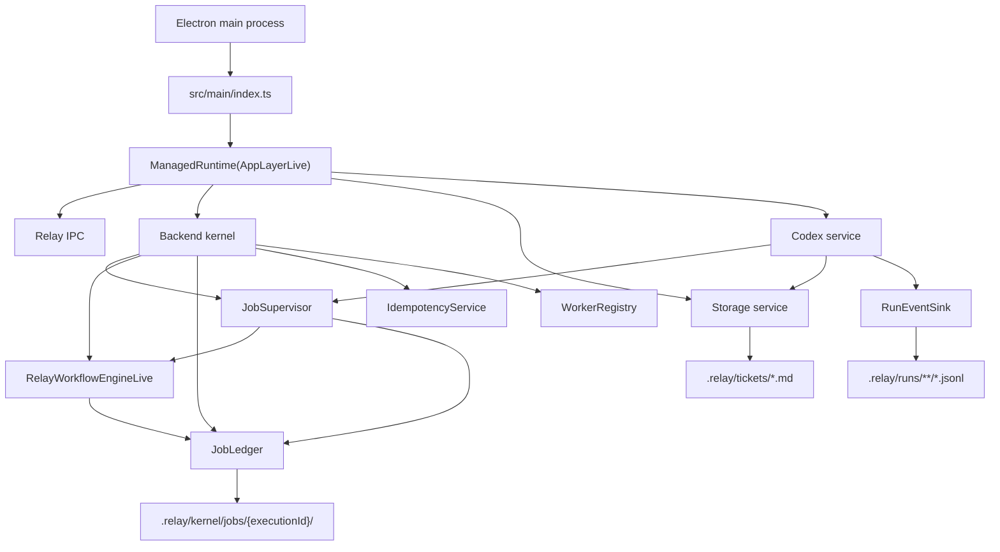
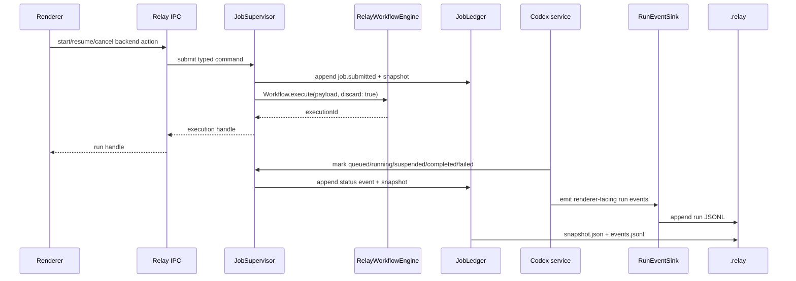

# Effect Workflow Kernel Decision

Status: Accepted for the Relay backend kernel

Date: 2026-05-12

## Decision

Relay now adopts `effect/unstable/workflow` behind a Relay-owned backend kernel boundary.

Production imports from `effect/unstable/workflow` are allowed only under `src/main/services/kernel/`. The rest of the backend continues to talk to Relay services such as `JobSupervisor`, `JobLedger`, `Storage`, and `RunEventSink`; renderer contracts still never expose Effect types.

Relay does not use `WorkflowEngine.layerMemory` in production. The app provides `RelayWorkflowEngineLive`, backed by the durable `.relay/kernel/jobs/{executionId}/` store:

- `snapshot.json` is the current execution state.
- `events.jsonl` is the append-only job event log.
- `Workflow.execute(..., { discard: true })` is the async submit path.
- `Workflow.interrupt` and `Workflow.resume` are exposed through `JobSupervisor`.

The existing board columns, ticket front matter, and run JSONL files remain stable and user-facing. The kernel ledger is the backend execution record for queued, running, suspended, cancelled, failed, and completed jobs.

## Current Layer Model

## Runtime Flow

## Guardrails

- `src/main/services/kernel/` is the only production boundary that may import `effect/unstable/workflow`.
- `WorkflowEngine.layerMemory` is blocked in production source and remains test-only.
- Kernel APIs stay typed. Relay does not expose a generic command bus to domain code.
- Every workflow payload must provide an idempotency key.
- Codex `AbortSignal` cancellation remains in place while kernel interruption parity is expanded.
- Board status and ticket `runStatus` stay visible product state; kernel status is backend execution state.

## Migration Notes

The first implementation is intentionally a bridge:

- Codex implementation, ticket draft, and ticket update runs now submit durable kernel jobs and update kernel status as their existing lifecycle progresses.
- The existing Codex scheduler and active-run maps still exist while parity is preserved.
- Boot recovery calls `JobSupervisor.recoverFromRegistry()` so incomplete persisted executions are reattached to the workflow engine.
- Future steps should move the remaining lifecycle maps into kernel-owned registries and model Git sync, remote sync, subprocess workers, and remote workers as typed workflow services.
